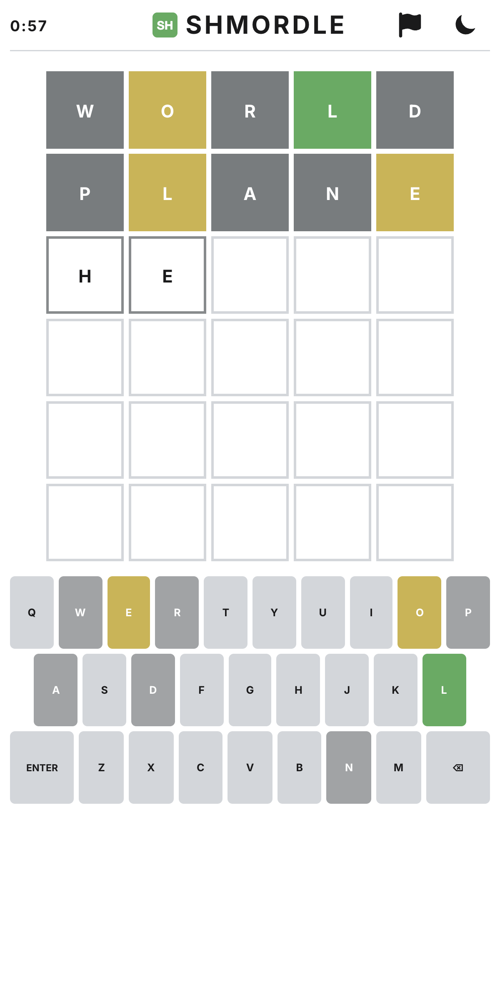

Shmordle is a Wordle-like word guessing game.



Shmordle is implemented using Spec Driven Development and Deepseek V4 (both PRO and Flash) running in [OpenCode](https://opencode.ai).

The project exists to play around and experiment with new AI-development techniques, models and harnesses.

# How to Play

```
npm install
npm run dev
```

and navigate to [http://localhost:5173/](http://localhost:5173/).

# Rules

You have **6 attempts** to guess a hidden 5-letter word. After each guess, the tiles change color to show how close you are:

- **Green** — The letter is correct and in the right position.
- **Orange** — The letter is in the word but in the wrong position.
- **Grey** — The letter is not in the word at all.

Use either the on-screen keyboard or your physical keyboard to type. Grey letters become disabled on both keyboards — you can't reuse them. Green and orange letters stay active.

Words must exist in the dictionary. If you type a word not in the list, a "Not in word list" message appears.

# Fun facts

- The initial playable implementation cost me just 0.37 USD :)  
- I've managed to teach Deepseek how to do TDD, which works suprisingly well (so far).

# License

[MIT](./LICENSE)
